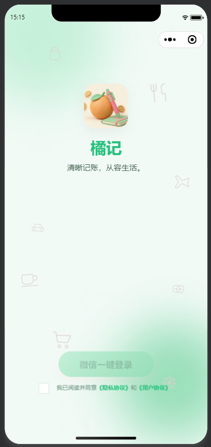
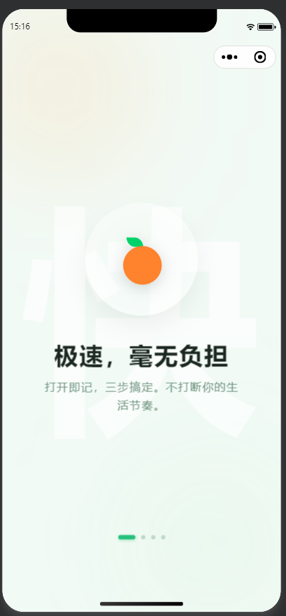
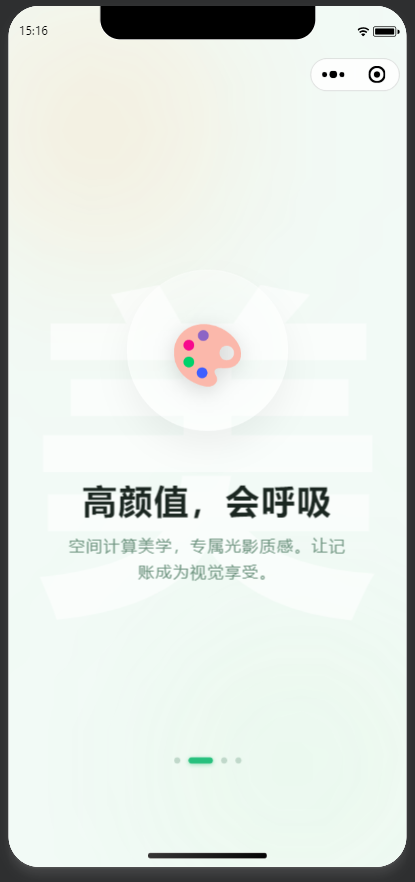
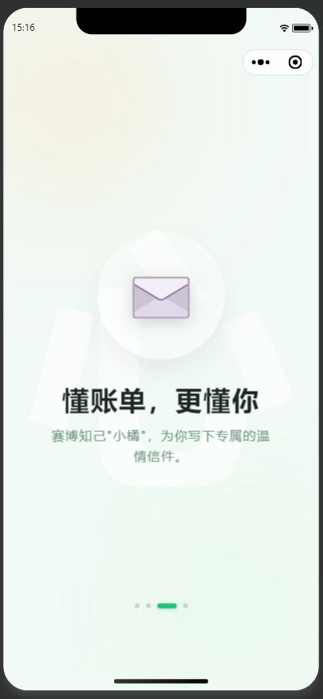
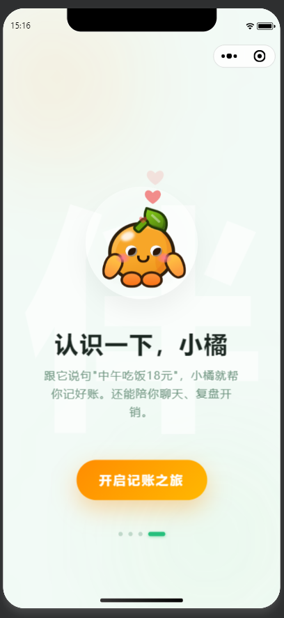
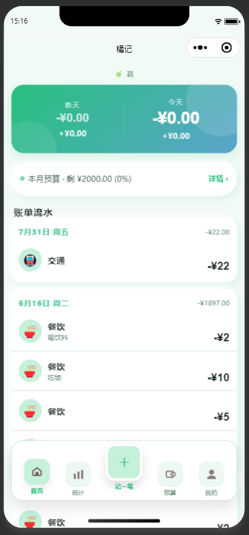
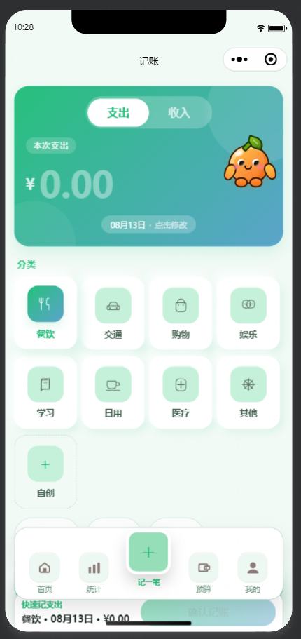
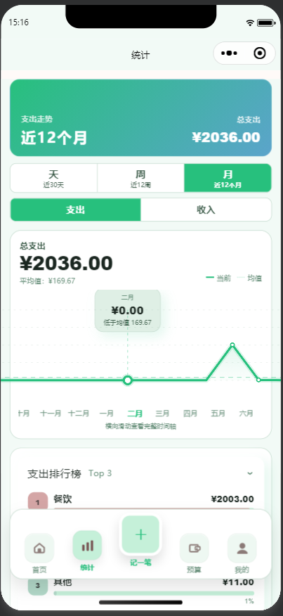
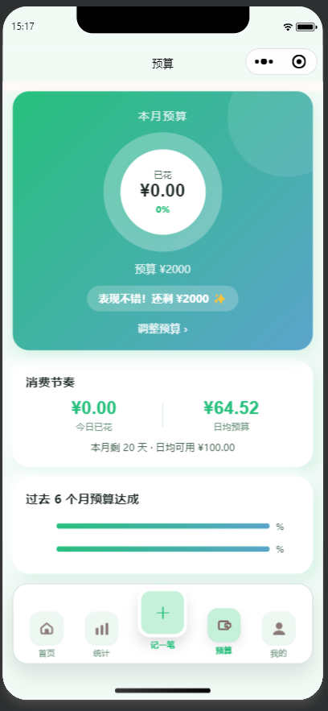
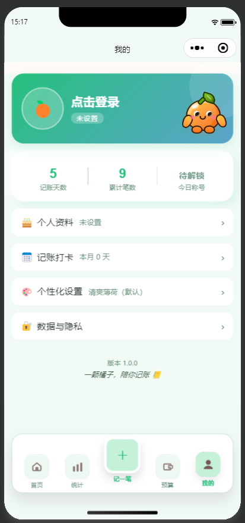

# 橘记 (JuJI) — 极简手动记账微信小程序

<p align="center">
  
</p>

🍊 一个让人愿意坚持用的记账习惯养成工具。打开就记，记完就走，月底安心回顾。陪伴你的是 AI 助手「小橘」——动动嘴就能记账，还能聊天、复盘开销。

## 界面预览

<p align="center">
  
  
  
  
</p>

<p align="center">
  
  
  
  
</p>

<p align="center">
  
  
</p>

## 技术栈

- **前端**：微信小程序原生（WXML + WXSS + JS），自定义 TabBar
- **后端**：腾讯云 CloudBase / 云开发（Serverless）
- **数据库**：CloudBase 文档型 NoSQL（`bills` / `budgets` / `users` / `ai_usage_limits` / `client_logs`）
- **AI**：腾讯混元大模型 `hunyuan-v3` → `hy3-preview`（统计页俏皮评论 + 我的页 AI 信件/每日称号 + 「小橘」聊天助手 + 对话记账，小程序成长计划 1 亿 Token）
- **存储**：CloudBase 云存储（账单照片、用户头像）
- **主题**：Design Token 体系 v2（70 个 CSS 变量），4 套预设 + 8 色自定义调色板 + 用户命名主题 CRUD（最多 5 个），inline-style 注入方案，切换后即时生效
- **UI 风格**：小红书 / Apple Wallet 风格（渐变 hero 卡 + 40rpx 大圆角 + Neumorphic 拟物阴影 + 跨色相渐变）
- **字体**：8 级字号 + 5 级字重 + 数字专属字体族（DIN Alternate / Helvetica Neue）

## 功能

### 记账
- 收/支双模式，滑块切换，**Neumorphic 3D 药丸控件**（毛玻璃背景 + 白底滑块）
- 金额大字输入（96rpx 数字专属字体），分类网格选择（8 预设 + 自创）
- **快速记账条**：金额聚焦时键盘上方出现「快速记支出/收入」确认按钮（默认分类 · 日期 · 第一预设心情），一键保存
- **自创分类**：页内弹窗，名称（maxlength=10）+ emoji 输入（maxlength=2 + placeholder 提示 + JS 校验兜底），即时创建并自动选中
- **长按删除自定义分类**：分类网格长按触发，安全守卫（仅允许删除自定义分类），二次确认弹窗 → DB 删除 → 状态同步
- **日期选择**：原生 picker mode="date"，智能显示今天/昨天/X月X日
- **心情记录**：8 预设 emoji + 自定义输入，可选
- 备注 + **Neumorphic 3D 相机按钮**（主色渐变背景 + 高光深影，100rpx 圆形）
- **小橘 AI 助手入口**：金额 hero 右侧圆形 CSS 吉祥物，随机 Hi / 跳动 / 发射爱心，点击打开同款聊天弹窗与对话记账确认卡
- 频率限制：3s 防抖 + 单日 500 笔上限

### 首页
- **渐变 hero 卡**（主色→accent 跨色相渐变）：今天 / 昨天消费双数字卡
- **预算进度条**：未设引导 / 正常进度 / 超支红色三态，点击弹出预算底部抽屉（bottom-sheet，可跳转预算页设定/调整）
- **季节标签**：当前季节氛围点缀
- **账单流水**：按日分组卡片（日期 + 周几 + 当日净额），近 30 条
- 点击账单 → **手账风格详情页**（拍立得照片框 + 心情印章 + 信纸纹理备注）
- 长按删除（二次确认）

### 统计页
- **渐变 hero 汇总卡**（主色→accent 跨色相渐变）：当前范围总支出/总收入 + 范围标签
- **天/周/月范围 tab**（近 30 天 / 近 12 周 / 近 12 个月）+ 收入/支出 **segment toggle**（primary-container 背景 + 白底激活态）
- **Canvas 2D 折线趋势图**：620ms 缓动动画、触摸十字准星 tooltip、均值虚线、横向滚动查看完整时间轴
- **收支排行榜**（collapsible 折叠面板）：Top 8 分类，默认展示 3 行，点击展开全部
- **AI 俏皮评论**（小橘的便签）：昨日 / 上周 / 上月三张卡片
  - 混元 `hy3-preview` `streamText`，串行调用 + 429 退避重试
  - `periodKey` 自动缓存，失败不写缓存允许重试
  - 「催小橘更新」强制刷新按钮 + 「AI生成，仅供娱乐」免责声明

### 预算页
- **渐变 hero 进度环**（主色→accent 跨色相，白色环 + 半透明白未完成）
- **过去 6 个月预算历史**（按月列出；达成率条形图字段尚未补算，渲染待完善）
- **消费节奏卡**：日均预算 / 今日消费 / 剩余天数 / 建议日均
- **钱去哪了**：Top 3 消费分类（emoji + 金额 + 百分比进度条）
- **灵犀建议卡**：本月 Top 分类消费占比提示（展示字段与数据字段尚未对齐，渲染待修复）
- **页内滑入面板**（budget-sheet）调整预算
- 未设预算空态引导

### 我的页
- **渐变 hero 头像区**（主色→accent 跨色相，白边头像 + 投影）
- 头像 / 昵称在线编辑（`editImage` 裁剪 → `compressImage` → 云存储 → `getTempFileURL`；写入走 `users` 云函数服务端校验）
- **微信资料授权**：未设置头像/昵称时显示引导条，一键同步微信头像（`chooseAvatar`）+ 微信昵称（`type="nickname"` 自动填充可修改）
- **记账足迹卡**：记账天数 / 累计笔数 / 最爱分类（可点击生成 AI 专属信件），数值区定高 60rpx + flex-end 基线对齐
- **记账打卡热力图**：月历热力视图，前后翻月，8 色自定义颜色
- **每日消费称号**（aiPoster `profileTitle`）：按当前消费类别生成俏皮称号，本地缓存 + 性别化兜底，每日限量
- **AI 信件生成**（拟物书信风弹窗）：混元文本大模型，足迹数据驱动 prompt，150-180 字俏皮鼓励信，每日限量。信纸横线纹理 + 🍊 左上角挂件 + 称呼层 + 正文对齐横线 + 右对齐落款
- **「小橘」AI 聊天助手**（我的页与记账页 hero 右上角 CSS 吉祥物，点击唤起聊天弹窗）：混元 `hy3-preview` 云函数，轻量闲聊 / 消费复盘，8 条 × 300 字上限，本地正则 + msgSecCheck 双层内容安全
- **小橘账单查询分析**：支持“这周花了多少钱 / 这周比上周省了多少 / 本月哪类花得最多”等高频问题，云函数直接查询 `bills`（过滤软删除）并确定性计算金额，不让 AI 编数字
- **小橘对话记账**：在聊天里用口语描述（如「中午吃饭18，买了瓶4元冰红茶，交了电费40」），AI 提取多笔账单 → 渲染待确认卡（可编辑金额/备注、删行）→ 确认后批量写入；非预设分类优先映射已有分类，新分类可勾选创建（否则归「其他」+备注原词）
- 性别 / 生日星座 / 职业设置、自定义分类管理、主题切换
- **JSON 数据导出**：云函数查询全部账单 → 清除内部字段 → `writeFile` 写入本地 → `shareFileMessage` 分享给文件传输助手
- **JSON 数据导入**：`chooseMessageFile` 选取 `.json` → 解析清洗 → 云函数分批写入（每批 20 条）
- **退出登录**：清除全局状态 + 跳转登录页，本地缓存保留，云端数据不丢失（符合审核标准 3.5.5）
- 数据清除（二次确认）

### 主题系统（Design Token 体系 v2）
- **4 套预设主题**：清爽薄荷 / 温馨玫瑰 / 夜猫子 / 蓝天白云
- **8 色自定义调色板**（Tailwind 400/500 级高饱和亮色）：樱花粉 / 蜜桃橙 / 柠檬黄 / 青葱绿 / 蒂芙尼蓝 / 鸢尾紫 / 玫瑰金 / 晴空蓝
- **用户命名主题 CRUD**：最多保存 5 个自定义主题，支持命名、切换、长按删除
- **accent 跨色相渐变**：每个主题有 primary + accent（primary.h + 60°）双色相，hero 渐变自动跨色相
- **Neumorphic 拟物阴影**：`--shadow-light`（高光）+ `--shadow-dark`（深影），per-theme 主题色
- **衍生 token 自动注入**：`--gradient-hero`、`--shadow-card` 等在 `getThemeStyleString()` 里计算实际值，避免 CSS var() 提前解析
- **旧版迁移**：`theme='custom'` + `custom_theme_color` 自动迁移到 `user_themes`

### 子页面
- **分类管理** (`pages/categories/`)：预设 + 自创列表，CRUD + emoji 图标池
- **主题预览** (`pages/themes/`)：预设主题 + 我的主题两区，创建面板（颜色 picker + 名称输入）
- **账单详情** (`pages/detail/`)：手账便签风格，金额 + 照片 + 心情 + 分类 + 日期 + 信纸备注 + 删除

### 登录 & 引导
- 微信一键静默登录（`quickstartFunctions` → `getOpenId`）
- 登录按钮带 `open-type="agreePrivacyAuthorization"`：勾选协议后点击一次即完成隐私授权并登录，无二次确认（未勾选时按钮禁用 + toast 兜底）
- 4 页滑动引导（柔光渐变背景 + emoji 入场动画 + 自定义圆点指示器）
- 首次安装显示，看过一次后不再出现

## Design Token 体系

> 共 70 个 CSS 变量（`app.wxss` 声明），每个主题经 `getThemeStyleString()` 计算实际值后内联注入页面。

### 颜色 Token（per-theme）

| Token | 说明 |
|-------|------|
| `--color-primary` | 主色调 |
| `--color-accent` | 跨色相互补色（primary.h + 60°） |
| `--color-primary-container` | 主色浅版（容器背景） |
| `--color-primary-light` | 主色亮版（高光） |
| `--color-on-primary` / `--color-text-on-primary` | 主色上方文字（自动对比度：浅色主色→深字，深色主色→白字） |
| `--color-secondary` / `--color-secondary-container` | 次级强调色（主色降明度变体）/ 浅版容器 |
| `--color-tertiary` / `--color-tertiary-container` | 第三强调色（主色同色相变体）/ 浅版容器 |
| `--color-bg` / `--color-surface` | 页面背景 / 卡片表面 |
| `--color-surface-low` / `--color-surface-container` / `--color-surface-high` / `--color-surface-highest` / `--color-surface-dim` | 表面 5 级亮度层级（低 / 容器 / 高 / 最高 / 暗淡） |
| `--color-text` / `--color-text-secondary` / `--color-text-tertiary` | 主/次/辅文字 |
| `--color-border` / `--color-outline` | 边框 / 轮廓 |
| `--color-income` / `--color-income-light` | 收入绿 / 收入浅绿（固定值） |
| `--color-error` / `--color-error-container` | 错误红 / 错误容器（固定值） |
| `--color-warning` | 警告（琥珀色） |

### 渐变 Token

| Token | 说明 |
|-------|------|
| `--gradient-hero` | 主色→accent 跨色相渐变（135deg） |
| `--gradient-hero-soft` | primary-container→primary-light 柔和渐变 |

### 阴影 Token（Neumorphic）

| Token | 说明 |
|-------|------|
| `--shadow-light` | 高光色（per-theme，浅色主题白色，暗色主题半透明白） |
| `--shadow-dark` | 深影色（per-theme，fresh 棕色，mint 绿色，dark 黑色） |
| `--shadow-soft` | 双侧柔阴影（-8rpx / 8rpx） |
| `--shadow-card` | 双侧卡片阴影（-12rpx / 12rpx） |
| `--shadow-elevated` | 双侧提升阴影（-16rpx / 16rpx） |
| `--shadow-hero` | 单侧 hero 阴影（0 16rpx） |

### 字体 Token

| Token | 说明 |
|-------|------|
| `--font-numeric` | 数字专属字体族（DIN Alternate / Helvetica Neue） |
| `--font-body` | 正文字体族 |
| `--font-hero` / `--font-headline-lg` / `--font-headline-md` | 组合排版 token（hero 大数字 / 大标题 / 中标题） |
| `--font-body-lg` / `--font-body-md` / `--font-label` | 组合排版 token（大正文 / 常规正文 / 标签） |
| `--font-size-display` (96rpx) | 记账页核心大数字 |
| `--font-size-h1` (52rpx) | 首页/预算核心数字 |
| `--font-size-h2` (44rpx) | 次级数字（足迹、进度环） |
| `--font-size-h3` (36rpx) | 三级标题 |
| `--font-size-body` (28rpx) | 正文 |
| `--font-size-regular` (26rpx) | 常规文字 |
| `--font-size-small` (22rpx) | 辅助标签 |
| `--font-size-tiny` (20rpx) | 微小说明 |
| `--font-weight-black` (800) | 核心数字 |
| `--font-weight-bold` (700) | 大数字 |
| `--font-weight-semibold` (600) | 标签 |
| `--font-weight-medium` (500) | 次级 |
| `--font-weight-regular` (400) | 正文 |

### 尺寸 Token

| Token | 说明 |
|-------|------|
| `--radius-sm` / `--radius-md` / `--radius-lg` / `--radius-xl` / `--radius-2xl` / `--radius-full` | 圆角 6 级（圆角 / 胶囊） |
| `--space-xs` / `--space-sm` / `--space-md` / `--space-lg` / `--space-xl` | 间距 5 级 |
| `--line-height-tight` / `--line-height-normal` / `--line-height-relaxed` | 行高 3 级 |

## 项目结构

```
miniprogram/                # 小程序前端
├── app.js                  # 入口：CloudBase 初始化 + 主题迁移 + 登录（syncUserInfo 同步用户资料）
├── app.json                # 路由 + 窗口 + 自定义 TabBar 配置（__usePrivacyCheck__ 开启）
├── app.wxss                # 全局 Design Token（70 个 CSS 变量）+ 通用组件样式
├── custom-tab-bar/         # 自定义毛玻璃 TabBar（5 列，中间记账按钮凸起）
├── components/
│   ├── bottom-sheet/       # 通用底部滑入抽屉（遮罩 + 面板 + 插槽；首页预算、记账心情）
│   └── collapsible/        # 通用折叠面板（标题 + meta + 插槽；统计页排行榜、我的页设置分区）
├── config/
│   └── env.js              # 环境配置（CloudBase ENV_ID + 版本号）
├── pages/
│   ├── login/              # 登录页（柔光 + 漂浮图标 drift 动画 + 单一授权登录按钮）
│   ├── guide/              # 新手引导（swiper + 入场动画）
│   ├── home/               # 首页（渐变 hero + 预算 + 分组流水 + 季节）
│   ├── stats/              # 统计（渐变 hero + Canvas 折线图 + 排行榜 + AI 评论）
│   ├── record/             # 记账（渐变 hero 金额 + Neumorphic 相机按钮 + 快速记账条）
│   ├── budget/             # 预算（渐变 hero 进度环 + 历史 + 消费节奏 + 建议卡）
│   ├── profile/            # 我的（渐变 hero 头像 + 足迹 + 热力图 + 称号 + AI 信件 + 导出）
│   ├── categories/         # 分类管理（预设 + 自创 CRUD）
│   ├── themes/             # 主题切换（预设 + 自定义主题 CRUD）
│   └── detail/             # 账单详情（手账便签风格）
├── utils/
│   ├── theme.js            # 主题系统核心（CSS 变量推导 + 用户主题 CRUD + 衍生 token 注入）
│   ├── eventBus.js         # 事件总线（on/off/emit，跨页面通信）
│   ├── rateLimiter.js      # 频率限制（防抖 + 日上限）
│   ├── validate.js         # 账单 / 预算输入校验
│   ├── privacy.js          # 隐私授权（onNeedPrivacyAuthorization + requirePrivacyAuthorization）
│   ├── contentSafety.js    # 内容安全（本地正则 + msgSecCheck 双层）
│   ├── monitor.js          # 前端异常监控（onError / onUnhandledRejection → client_logs）
│   ├── dbPager.js          # 数据库分页拉取（绕开 20 条查询上限）
│   ├── profileHelpers.js   # 我的页辅助（星座 / 称号兜底 / 分类 emoji 等）
│   └── avatar.js           # 头像地址解析（cloud:// fileID → 临时 https URL）
└── images/
    ├── login/              # 登录页 SVG 图标（8 个，灰色调）
    ├── record/             # 记账页 SVG 图标（14 个，黑色调，filter 染色）
    └── tabbar/             # TabBar 图标

cloudfunctions/             # 云函数
├── quickstartFunctions/    # 登录获取 openid
├── users/                  # 用户资料服务端校验（updateProfile / updateAvatar / updateCustomCategories）
├── bills/                  # 账单服务端校验（create / delete 软删除 / update / batchCreate）
├── budgets/                # 预算服务端校验（按月 upsert）
├── exportBills/            # CSV 导出到云存储
├── dataMigration/          # JSON 数据迁移（导出全部 / 分批导入）
├── clearUserData/          # 清除当前用户账单 / 预算 / 文件 + 重置资料（物理删除）
├── aiPoster/               # AI 信件 + 每日消费称号（混元，ai_usage_limits 限流）
├── aiChat/                 # 「小橘」聊天助手 + 账单查询分析 + 对话记账解析（混元）
└── contentSafety/          # 文本内容安全（本地正则 + msgSecCheck）
```

## 架构概览（给新手）

这个小程序是**纯前端 + 云开发**的模式，不需要自己搭服务器：

```
你写的代码 (WXML/WXSS/JS)  →  微信小程序前端
                                 │
                  ┌──────────────┼──────────────┐
                  ▼              ▼              ▼
            云数据库          云函数           云存储
          (NoSQL文档)     (Node.js后端逻辑)   (照片/头像/CSV/JSON备份)
                  │              │              │
                  └──────────────┼──────────────┘
                                 ▼
                          腾讯云 CloudBase
                         (帮你管服务器/数据库/文件)
```

- **WXML** = 小程序版的 HTML（写页面结构）
- **WXSS** = 小程序版的 CSS（写样式，支持 `var(--color-primary)` 这种变量）
- **JS** = JavaScript（写交互逻辑，调用 `wx.cloud.database()` 读写数据库）
- **云函数** = 跑在腾讯云上的 Node.js 代码，处理需要服务端做的事情（账单/预算/用户资料服务端校验、批量记账、CSV 导出、JSON 数据迁移、清除用户数据、AI 信件/称号、「小橘」聊天与对话记账、内容安全审核）
- **主题怎么切换的**：`utils/theme.js` 的 `getThemeStyleString()` 把 60+ 个颜色/阴影/渐变变量计算成实际值，拼成字符串注入每页最外层 view 的 `style` 属性，所有 `var(--color-*)` 自动生效
- **为什么不用 CSS var() 继承**：微信小程序的 `page {}` 中声明的 CSS 变量会在声明时被解析为默认值，不会跟随子 view 的内联 style 覆盖重新解析。因此衍生 token（`--gradient-hero` 等）必须在 `getThemeStyleString()` 里直接计算实际值

## 开始

1. 微信开发者工具导入项目（需填入你自己的 AppID）
2. 部署所有云函数：右键每个文件夹 →「上传并部署：云端安装依赖」
3. 创建数据库集合 `bills`、`budgets`、`users`、`ai_usage_limits`、`client_logs`（权限：「仅创建者可读写」）
4. 在微信公众平台 → 行业能力 → 小程序成长计划 报名，获取 AI Token
5. CloudBase 控制台 → AI+ 扩展能力 → 开通混元大模型，接入 `hunyuan-v3`

## 部署信息

### CloudBase 环境

| 项目 | 值 |
|------|------|
| 环境 ID | `lajiaoyou-d4g78yts61f1a841d` |
| 区域 | ap-shanghai |
| 套餐 | 个人版 |
| 状态 | NORMAL ✅ |

### 控制台入口

- [概览](https://tcb.cloud.tencent.com/dev?envId=lajiaoyou-d4g78yts61f1a841d#/overview)
- [云函数](https://tcb.cloud.tencent.com/dev?envId=lajiaoyou-d4g78yts61f1a841d#/scf)
- [数据库](https://tcb.cloud.tencent.com/dev?envId=lajiaoyou-d4g78yts61f1a841d#/db/doc)
- [云存储](https://tcb.cloud.tencent.com/dev?envId=lajiaoyou-d4g78yts61f1a841d#/storage)
- [静态托管](https://tcb.cloud.tencent.com/dev?envId=lajiaoyou-d4g78yts61f1a841d#/static-hosting)

### 云函数清单

> 部署状态和最后更新时间以 CloudBase 云开发控制台为准，README 仅记录当前代码中的云函数职责。

| 函数名 | 运行时 | 说明 |
|--------|--------|------|
| `quickstartFunctions` | Nodejs16.13 | 登录获取 openid；`users` 文档创建 + `lastLoginAt` 由 `miniprogram/app.js` 的 `syncUserInfo()` 直写，字段更新走 `users` 云函数 |
| `users` | Nodejs16.13 | 用户资料服务端校验：`updateProfile`（昵称/性别/生日/职业，白名单字段 + 内容安全）/ `updateAvatar`（`cloud://` 前缀校验）/ `updateCustomCategories`（同名去重 + 上限 50） |
| `bills` | Nodejs16.13 | 账单服务端校验 create / delete（**软删除**：`isDeleted` + `deletedAt`）/ update / batchCreate（批量写入供对话记账使用） |
| `budgets` | Nodejs16.13 | 预算服务端校验，按 `month` upsert（一月一条） |
| `exportBills` | Nodejs16.13 | CSV 导出到云存储；当前主要 UI 导出路径为 `dataMigration` 的 JSON 导出 |
| `dataMigration` | Nodejs16.13 | JSON 数据迁移（export 查询全部 / import 分批写入） |
| `clearUserData` | Nodejs16.13 | **物理删除**当前用户全部账单 / 预算 + 云存储文件，并重置 users 资料 |
| `aiPoster` | Nodejs16.13 | AI 信件 + 每日消费称号（混元 `generateText`，`ai_usage_limits` 按功能限流） |
| `aiChat` | Nodejs16.13 | 「小橘」聊天助手 + 账单查询分析 + 对话记账解析（确定性查库统计（过滤软删除）+ 混元 `generateText` 结构化 JSON） |
| `contentSafety` | Nodejs16.13 | 文本内容安全（本地正则 + `security.msgSecCheck` v2） |

> 注：`Nodejs16.13` 是 CloudBase 控制台的部署配置，代码库 config.json 不含 runtime 字段。

### 数据库集合

| 集合 | 权限 | 主要字段 |
|------|------|------|
| `bills` | 仅创建者可读写 | `type, amount, category, date, note, photoUrl, mood, isDeleted, deletedAt, createdAt` |
| `budgets` | 仅创建者可读写 | `month, amount, createdAt` |
| `users` | 仅创建者可读写 | `nickname, avatarUrl, gender, birthday, occupation, customCategories, theme, budgetDefault, createdAt, lastLoginAt, updatedAt` |
| `client_logs` | 仅创建者可读写 | `type, message, stack, route, createdAt` |
| `ai_usage_limits` | 仅创建者可读写 | `_openid, date, feature, count, limit, createdAt, updatedAt` |

### 运维与备份

- **前端异常监控**：`miniprogram/utils/monitor.js` 监听 `wx.onError` 和 `wx.onUnhandledRejection`，写入 `client_logs` 集合；建议在 CloudBase 控制台创建 `client_logs`，权限设为“仅创建者可读写”，定期按 `createdAt` 清理 30 天前日志。
- **云函数日志**：云函数失败时使用 `[function] action failed` 格式输出 `action/openid/message/code`，排障优先查看 CloudBase 控制台对应函数日志。
- **数据备份**：每周在“我的页”执行 JSON 导出，并将备份文件保存到独立位置；大版本发布前必须额外导出一次。
- **数据恢复**：使用“我的页”JSON 导入，导入前先确认备份文件来源可信；导入后检查首页、统计页、预算页数量和金额是否符合预期。
- **灾难恢复**：如误删或线上异常，先暂停提审/发布，保留 CloudBase 日志，再用最近一次 JSON 备份分批恢复账单数据。

### 隐私与协议提审

- **隐私授权链路（规范版）**：`utils/privacy.js` 按微信小程序隐私保护最新规范实现。
  - 通过 `wx.onNeedPrivacyAuthorization` 全局监听需要授权的场景（头像、相机、相册、文件、录音等）。
  - 触发授权时调用当前页面的 `showPrivacyAuthorizeButton()`，显示**真实的** `<button open-type="agreePrivacyAuthorization">` 授权按钮；用户点击后由 `bindagreeprivacyauthorization` 回调调用 `handlePrivacyAuthorize(e)` → `resolvePrivacyAuthorization()` 完成授权。
  - `requirePrivacyAuthorization(feature)` 统一封装：先 `wx.getPrivacySetting` 判断是否需要授权，再 `wx.requirePrivacyAuthorize` 调起，避免旧实现中"假授权"导致的死循环。
  - **登录页单一授权入口**：登录按钮直接携带 `open-type="agreePrivacyAuthorization"`，勾选协议后点击一次即完成授权并登录（无需再调 `requirePrivacyAuthorization`）；未勾选时按钮禁用 + toast 兜底提示。
  - 调试开关 `PRIVACY_DEBUG_BYPASS`（默认 `false`）仅在本地排查时临时开启，正式提审前必须保持 `false`。
- 微信公众平台**用户隐私保护指引**必须同步声明并审核通过：头像/昵称、相机、相册、文件、录音（麦克风）、账单记录、AI 文本生成所需的消费统计数据；否则真机会反复弹出空白隐私页（更新日期显示 1970）。
- “我的页”提供隐私协议和用户协议入口；用户拒绝隐私授权时，相机/相册/文件/录音能力应保持降级，不继续读取本地文件或媒体。

### AI 能力

- **文本生成（客户端）**：`wx.cloud.extend.AI.createModel('hunyuan-v3').streamText`，模型 `hy3-preview`
  - 用途：统计页 AI 俏皮评论（昨日 / 上周 / 上月）
- **文本生成（云函数）**：`app.ai().createModel('hunyuan-v3').generateText`，模型 `hy3-preview`
  - `aiPoster`：我的页 AI 信件（记账天数 + 最爱分类 → 150-180 字俏皮鼓励信）+ 每日消费称号（严格 JSON `{title, reason, category}` 输出 + 容错解析 + 本地兜底映射表，输出经 msgSecCheck 审查）
  - `aiChat`：「小橘」聊天助手 + 账单查询分析 + 对话记账（口语 → 结构化 JSON `{intent, reply, bills}`，容错解析 + `temperature 0.2`）
- 资源包：小程序成长计划 1 亿 Token（`pkg_hunyuan_token_la_inspire_100m`）

### 语音输入（规划中，未实现）

- **目标**：在「小橘」聊天框接入微信同声传译插件（`WechatSI`），用户长按🎤说话 → 松手出普通话文字 → 直接作为聊天内容发送 → 复用现有 AI 对话记账链路。
- **现状**：已尝试接入，因微信同声传译插件不可用而回退（见提交 `2f7a949`），规划保留。
- **方案**：`app.json` 声明插件；新建 `utils/speech.js` 封装 `getRecordRecognitionManager()` 的 start/stop/识别回调；录音前调用 `requirePrivacyAuthorization('麦克风')` 复用已规范的隐私授权弹窗。
- **依赖**：需先在微信公众平台「设置 → 第三方设置 → 插件管理」添加「微信同声传译」插件（免费），并在隐私保护指引中补充「麦克风/录音」声明。

## License

MIT

---

## 部署历史

| 日期 | 版本 | 变更 |
|------|------|------|
| 2026-08-13 | **v1.1.7（工作区，未提交/未部署）** | 新增 `users` 云函数（用户资料写入收敛为服务端校验：`updateProfile` / `updateAvatar` / `updateCustomCategories`，白名单字段 + 内容安全）；我的页新增「使用微信资料」一键同步头像昵称（`chooseAvatar` + `type="nickname"`，未设置时显示引导条）；账单软删除（`isDeleted`）全面过滤（首页 / 统计 / 预算 / 足迹 / 热力图 / AI 账单查询）；登录页重构为单一授权入口（`agreePrivacyAuthorization` 直接登录，无二次确认）；`project.config.json` 清理模板残留（projectname→juji、packOptions.ignore 清空） |
| 2026-07-31 | **v1.1.5** | 全量更新 9 个云函数代码（quickstartFunctions / bills / budgets / exportBills / dataMigration / clearUserData / aiPoster / aiChat / contentSafety）；登录页启用隐私协议勾选框 UI（调试版本临时注释校验逻辑便于真机测试） |
| 2026-08-03 | **v1.1.6** | 修复隐私授权死循环：重写 `utils/privacy.js` 为微信规范授权流程（`onNeedPrivacyAuthorization` + 真实 `open-type="agreePrivacyAuthorization"` 按钮回调）；登录/我的/记账三页接入标准隐私授权弹窗；根因补充——需公众平台填写用户隐私保护指引，否则真机反复弹空白隐私页 |
| 2026-07-30 | **v1.1.4** | 环境配置解耦（新增 config/env.js）；Theme CSS 变量与 setData 传输瘦身；EventBus 增量缓存（解决切 Tab 闪烁与重复查库）；小橘 AI 形象重构为糯米 Q 弹 2D 矢量可爱风（圆润四肢、柔和腮红、透亮眼点） |
| 2026-06-13 | **v1.1.3** | 小橘动画动作概率调整：4 个动作（待机 / 发射爱心 / 招手 / 跳动）概率统一为 25%，便于截图展示 |
| 2026-06-12 | **v1.1.2** | 小橘聊天新增确定性账单查询分析：本周/本月/今天支出收入、同比上周/上月省钱或多花、Top 分类、记账笔数等问题先由云函数查询 `bills` 计算后回复；我的页和记账页聊天窗口新增推荐问题胶囊，点击即可发送 |
| 2026-06-11 | **v1.1.1** | 记账页金额 hero 右侧新增同款「小橘」AI 助手：随机 Hi / 跳动 / 高概率发射爱心，点击打开与“我的页”一致的聊天弹窗和对话记账确认卡；金额输入自动聚焦改为受控状态，避免聊天弹窗打开时被底层金额键盘抢焦点；调试版本临时绕过隐私协议校验，便于隐私协议未通过期间验证功能 |
| 2026-06-11 | **v1.1.0** | 引导页新增第 4 屏「遇见小橘」：吉祥物招手 + 发射爱心，介绍对话记账与聊天复盘（沿用现有毛玻璃悬浮球 / 水印汉字 / 错落入场设计语言）；README 展示「小橘」形象图 |
| 2026-06-11 | **v1.0.9** | 新增「小橘对话记账」：AI 从口语提取多笔账单 → 待确认卡（可编辑金额/备注/删行）→ 批量写入；非预设分类优先映射，新分类可勾选创建（否则归「其他」+备注原词）；`bills` 新增 `batchCreate`，`aiChat` 结构化 JSON 输出 + 容错解析 + temperature 0.2；优化「我的」页小橘 CSS 形象 |
| 2026-06-11 | **v1.0.8** | 全量更新 9 个云函数（quickstartFunctions / bills / exportBills / aiPoster / dataMigration / aiChat / contentSafety / budgets / clearUserData）；修复 clearUserData 云函数（安全清除用户数据）；新增 aiChat（AI 聊天）、contentSafety（内容安全）、budgets（预算服务端校验）、clearUserData（清除用户数据）4 个云函数 |
| 2026-06-06 | **v1.0.7** | 新增退出登录功能（符合审核标准 3.5.5）；编辑账单防重复 — onHide 不清除编辑状态 + update 返回值校验；`project.config.json` key 排序同步 + 审核参考文档 |
| 2026-05-31 | **v1.0.6** | 新增 `dataMigration` 云函数（JSON 导出/导入）；记账页 Emoji 输入校验 + 长按删除自定义分类；足迹卡片基线对齐；AI 信件弹窗拟物书信风重构 |
| 2026-05-26 | **v1.0.1** | 部署 `bills`（新增 update）、`aiPoster`（修复语法 + 场景多样化）；引导页重构、主题显示 bug 修复、编辑账单功能、预算弹窗居中化 |
| 2026-05-24 | v1.0.0 | 首次全量部署：4 个云函数 + 小程序前端 |
